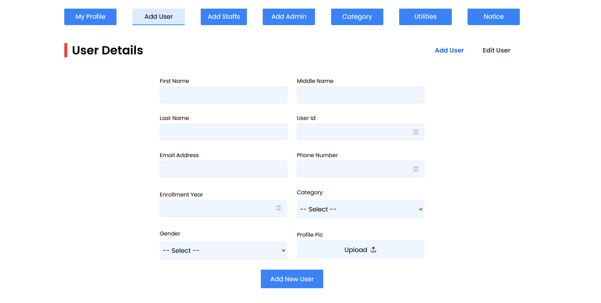

# Utility-Billing-System

## Overview
The **Utility-Billing-System** is a comprehensive solution designed to handle utility bills for electricity, water, gas,taxes and other utilities. This system streamlines the billing process, offering both administrators and users an intuitive interface to manage and track their bills efficiently.

## Tech Stack
The project is built using the **MERN** stack:
- **MongoDB**: A NoSQL database to store and manage all data related to users, bills, and utility services.
- **Express.js**: A web application framework for Node.js, used to build the backend of the application.
- **React.js**: A JavaScript library for building user interfaces, used to create the frontend of the application.
- **Node.js**: A JavaScript runtime built on Chrome's V8 engine, used to run the backend server and handle requests.

## Setup and Installation

### 1. Clone the Repository
```bash
git clone https://github.com/arunsah10/Utility-Billing-System.git
cd Utility-Billing-System
```

### 2. Install Dependencies
For both frontend and backend, navigate to their respective directories and install the necessary dependencies:
```bash
# For backend
cd backend
npm install

# For frontend
cd frontend
npm install
```

### 3. Setup `.env` Files
Create a `.env` file in both the `backend` and `frontend` directories.

#### Backend `.env`:
```env
MONGODB_URI =yours mongodb uri
PORT = 5000
FRONTEND_API_LINK = http://localhost:3000
```

#### Frontend `.env`:
```env
REACT_APP_APILINK = http://localhost:5000/api

REACT_APP_MEDIA_LINK = http://localhost:5000/media

```

Here's the updated section to include the database setup for the initial admin:

---

### 4. Setup the Database with First Manual Admin

To initialize the database with the first admin user, follow the steps below:

1. **Add Admin Credentials**: Insert the following document into the `admin credentials` collection in your MongoDB database:
   ```json
   {
     "_id": {
       "$oid": "the id will be generated"
     },
     "loginid": 123123,
     "password": 112233
   }
   ```

2. **Add Admin Details**: Insert the following document into the `admin details` collection in your MongoDB database:
   ```json
   {
     "_id": {
       "$oid": "the id will be generated"
     },
     "employeeId": 123123,
     "firstName": "Arun",
     "middleName": "Kumar",
     "lastName": "Sah",
     "email": "test@admin.com",
     "phoneNumber": 256723663,
     "gender": "Male",
     "profile": "profile.jpg"
   }
   ```

Your initial admin login details are:
- **Login ID**: `123123`
- **Password**: `112233`

Make sure to secure these credentials appropriately after the setup.

### 5. Run the Application Locally
```bash
# Start the backend server
cd backend
npm start

# Start the frontend server
cd frontend
npm start
```
The frontend will run on `http://localhost:3000` and the backend on `http://localhost:5000`.

## Docker Setup

### Build Docker Images
```bash
# Build frontend image
docker build -f Dockerfile.dev -t appfrontend .

# Build backend image
docker build -f Dockerfile.dev -t appbackend .
```

### Run Docker Containers
```bash
# Run frontend container
docker run -it -d --name frontend1 -p 3000:3000 appfrontend

# Run backend container
docker run -it -d --name backend2 -p 5000:5000 appbackend
```

### Docker Commands
- **View Docker Images**:
  ```bash
  docker images
  ```
- **View Running Containers**:
  ```bash
  docker ps
  ```
- **View All Containers** (including stopped ones):
  ```bash
  docker ps -a
  ```

## Application Screenshots

- **Main Page**: <br>
  

- **Admin Dashboard**: <br>
  

- **Add Admin Page**: <br>
  

- **Add Bills Page**: <br>
  

- **Add Employee Page**: <br>
  

- **Add User Page**: <br>
  


- **Notices Page**: <br>
  

- **Relevant Documents Page**: <br>
  

- **User Categories Page**: <br>
  

- **User Bills Page**: <br>
  

- **Utilities Overview**: <br>
  


## Features
- **Admin Dashboard**: Allows administrators to manage users, employees, and bills.
- **Employee Dashboard**: Employees can view, add, and update users bills and set different documents and notices for user reference.
- **Bill Management**: Users can view their bills, check for notices and docs.
- **Document Management**: Employee can upload and manage relevant documents.
- **Notices and Announcements**: Admins and Employee can post notices for users.
- **Responsive Design**: The application is fully responsive and works seamlessly on all devices.


## Author

**Arun Kumar Sah**

## Copyright

© 2024 Arun Kumar Sah. All rights reserved.
